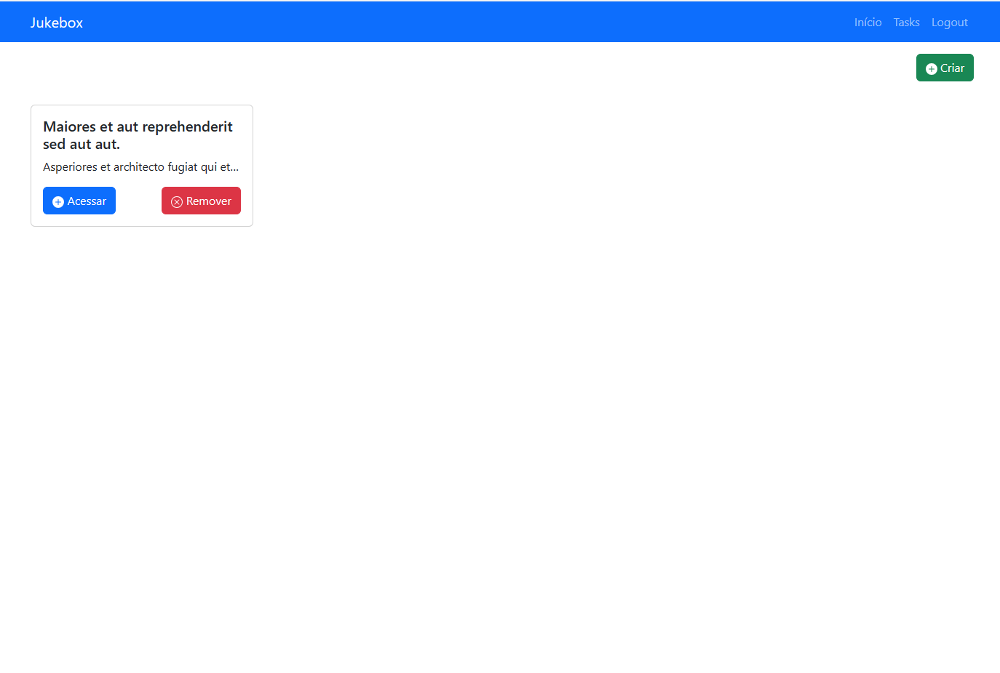

# Teste técnico Jukebox

Teste técnico para vaga de desenvolvedor full stack na Jukebox

<p align="center">
    
</p>

# Stack utilizada

## Back-End (API)
- PHP 8.3.1
- MySQL 8
- Laravel 10
- Firebase: kreait/laravel-firebase 5.6
- Laravel Sail 8.3
- Docker 24.0.7, build afdd53b
- Docker Compose docker-compose version 1.29.2, build unknown
- PHPCS

## Front-End
- Vue.js 3.2.13
- Vue Router 4.2.5
- firebase 10.7.1
- Bootstrap 5.3.2
- ESLint 8.56

# Padrões

- Rest

## Arquitetura

- MVC

### Pattenrs além dos padrões básicos do framework

- Respository;
- Dependency injection;
- Service container;
- Traits.

### Versionamento (Git)

- Padrão de commits: **Conventional Commits**

Obs: Todo o desenvolvimento foi feito com o docker e docker compose instalados em ubuntu 22.04.3 LTS configurado no wsl 2.

# Rodando a aplicação

```plaintext
Para inicializar o projeto corretamente utilizando Laravel Sail você deve ter docker e docker-compose instalados e já ter configurado um app no firebase.
```
Passo a passo para instalar o docker em seu sistema operacional

[https://www.docker.com/get-started](https://www.docker.com/get-started)

Após a instalação do docker e docker compose você pode configurar o seu app no firebase conforme os passos a seguir:

- Crie uma conta no firebase (ou autentique com sua conta google);
- Após autenticado selecione a opção adicionar projeto;
- Dê um nome ao seu projeto;
- Não é necessário ativar o google analytics para estes testes;
- Clique em **Criar projeto**;
- A visão geral do seu projeto será carregada;
- Clique no botão **</>** para iniciar uma integração com nosso app web;
- De um apelido a integração e clique em registrar app;
- Agora serão exibidos os seus dados de autenticação no firebase;
- Guarde as chaves contidas na constante **firebaseConfig** (Precisaremos utiliza-las posteriormente);
- Clique em **continuar no console**;
- No botão ao lado esquerdo de **+ Adicionar app** selecione a sua integração;
- Acesse a aba **Cloud Messaging**;
- Clique em **Generate key pair**;
- Guarde a chave exibida (Precisaremos utilizá-la posteriormente);
- Agora acesse novamente **Configurações do projeto** e acesse a aba **Contas de serviço**, clique em **gerar nova chave privada** e confirme (Guarde o arquivo gerado, pois precisaremos mais tarde);
- Agora habilitaremos a autenticação na nossa integração: Acesse a visão geral do projeto, clique em **Criação**, **Authentication** na lateral esquerda, Clique em **Vamos começar**;
- Dentro de **Authentication** acesse a aba **Sign-in method** e habilite a autenticação por e-mail e senha clicando na opção **E-mail/senha** em **Provedores nativos** e **Ativar** no toggle, agora salve.

#### Agora com docker, docker compose instalados e com app firebase configurado, prossiga com os readmes específicos do backe-end(api) e do front-end.

## Back-End API [README.md](api/README.md)

## Front-End [README.md](front/README.md)


